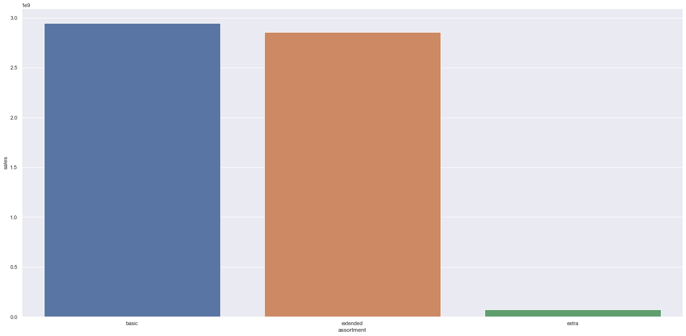
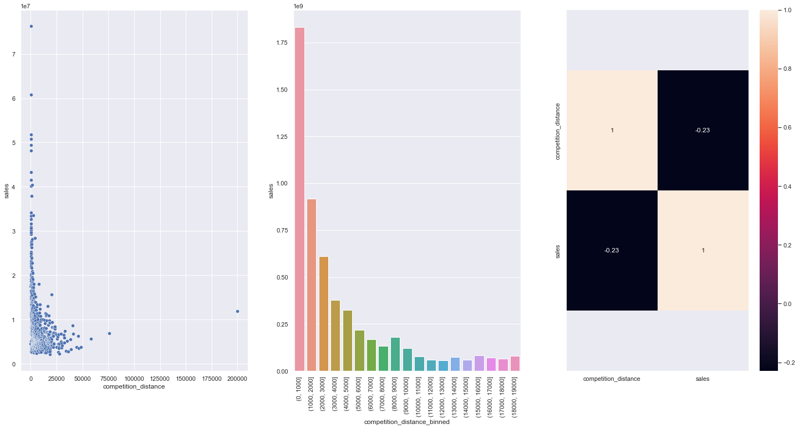
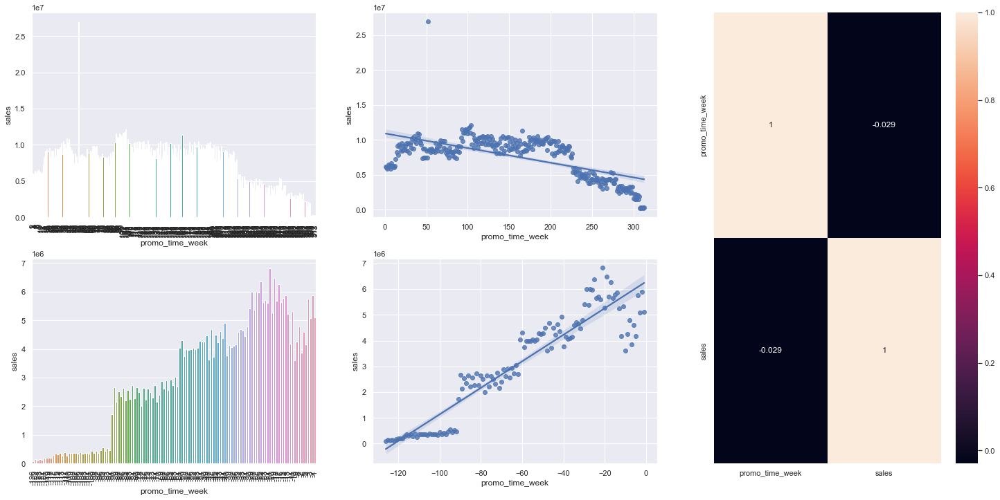
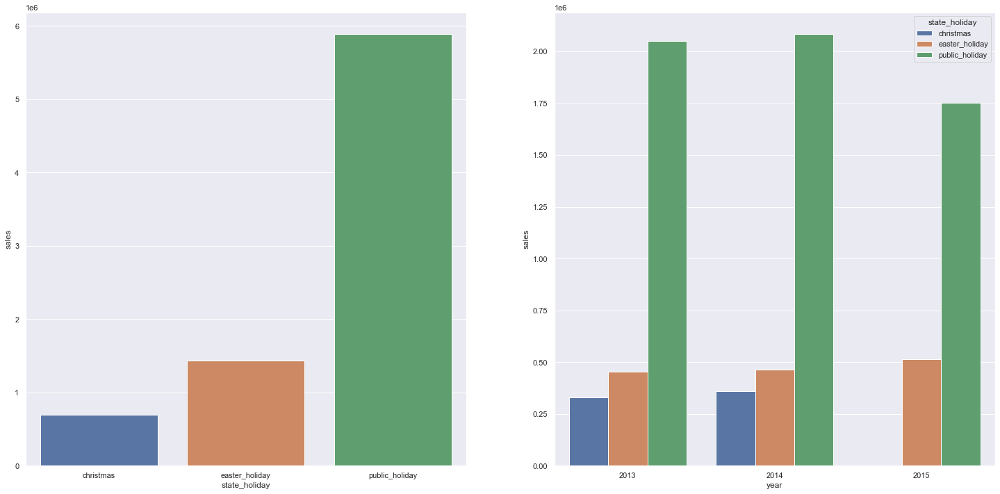

 <h1 align="center">Projeto Rossmann - Previsões de vendas </h1>

 
 

Este é um projeto fictício, porém a empresa e os dados são reais. Aqui eu segui as recomendações da [Comunidade DS](https://comunidadeds.com/) no curso de DS em produção.

# 1. Problema do negócio 
A *Rossmann* é uma das maiores redes de drogarias e perfumarias da Europa que opera em mais de 3.000 lojas em 7 países europeus. As vendas da Rossmann podem ser ifluenciadas por promoções, competição, feriados escolares e estaduais, sazonalidade, localidade, entre outros. Este projeto de *Data Science* tem como objetivo resolver a questão abaixo exigida pelo CEO da Rossmann.

*   Qual a previsão de vendas das próximas seis semanas para cada loja, a fim de determinar a melhor alocação de recursos para cada renovação das lojas?

# 2. Descrição dos dados
Os dados para este projeto podem ser encontrados [na plataforma Kagle](https://www.kaggle.com/competitions/rossmann-store-sales/data). Abaixo seguem as definições para cada um dos atributos (feature):
| Feature | Definição |
|---|---|
| Id | um Id que representa uma duplicata (Store, Date) no conjunto de dados.|
| Store | um ID exclusivo para cada loja.|
| Sales | o volume de negócios de um determinado dia.|
| DayOfWeek | dia da semana em que a venda foi feita |
| Date | data em que a venda foi realizada.|
| Customers | o número de clientes em um determinado dia.|
| Open | um indicador binário para saber se a loja estava aberta ou fechada|
| StateHoliday |No geral, com poucas exceções, todas as escolas estão fechadas nos feriados e fins de semana.|
| SchoolHoliday  | indica se a (Loja, Data) foi afetada pelo fechamento de escolas públicas.|
| StoreType  | diferencia entre 4 modelos de loja diferentes|
| Assortment | descreve um nível de sortimento: a = básico, b = extra, c = estendido.|
| CompetitionDistance | distância em metros até a loja concorrente mais próxima.|
| CompetitionOpenSince(Month/Year)| fornece o ano e o mês aproximados em que o concorrente mais próximo foi aberto.|
| Promo | indica se uma loja está realizando uma promoção naquele dia.|
| Promo2 | A Promo2 é uma promoção contínua e consecutiva para algumas, a feature é categórica|
| Promo2Since(Year/Week)| descreve o ano e a semana do calendário em que a loja começou a participar da Promo2.|
| PromoInterval | descreve os intervalos consecutivos em que a Promo2 é iniciada, nomeando os meses em que a promoção é iniciada novamente.|

# 3. Premissas do Negócio
As premissas do negócio são realizadas para melhorar a qualidade das análises, assim as premissas do negócio estão descritas abaixo:
* Dados de venda iguais a 0 foram e de lojas fechadas foram removidos;
* No atributo CompetitionDistance, foi observado que os dados faltantes poderiam ser devido a falta de concorrência ou a uma distância muito alta entre as lojas. Assim, os NaN's foram substituídos por 3 vezes o máximo CompetitionDistance no conjunto de dados. Nessa situação, uma nova feature foi criada.
* Com relação a existência de competitores, para os dados faltantes de aberuta das lojas e competidores relacionados ao mês e ao ano foram atribuídos as datas de venda das lojas;
* Dados de promoções seguiram a mesma base de alteração dos de abertura das lojas, só que para semana e ano.

# 4. Planejamento e solução

 A solução do problema se dará com base no ciclo CRISP, em alguns passos que foram adaptados a metodologia. Aplicamos um modelo de Machine Learning para descobrir os valores de vendas de cada loja (com seis semanas de antecedência):

- <b> Entendendo o problema do negócio </b> : Compreender as razões pelas quais o CEO da Rossmann estava exigindo essa tarefa e planejar a solução.

- <b> Coletando dados </b>: Coletando dados de loja e vendas da Rossmann do Kaggle.

- <b> Limpeza de dados </b>: Renomear colunas, alterar tipos de dados e preencher NaN's. 

- <b> Feature Engineering </b>: Criar novos recursos a partir dos originais, para que possam ser usados no modelo de ML.

- <b> Exploratory Data Analysis (EDA) </b>: Em tal etapa, os dados foram explorado para obter experiência de negócios, buscar insights úteis e encontrar recursos importantes para o modelo de ML. 

- <b> Preparação de Dados </b>: Aplicação de Técnicas de Normalização e Reescalonamento nos dados; métodos de Encondagem e Transformação de Variáveis ​​de Resposta.

- <b> Seleção de features </b>: Selecionando os melhores features para serem usadas ​​no modelo de ML, aplicando o Algoritmo de Boruta. Foram testados quatro algoritmos com o auxílio da técnica de cross-validation e de métricas de desempenho (MAE, MAPE, RSME).

- <b> Machine Learning </b>: Foi utilizado algoritmos de regressão de treinamento. O melhor modelo foi selecionado para ser aprimorado via Hyperparameter Tuning. 

- <b> Avaliação do Modelo </b>: O modelo foi avaliado usando quatro métricas: MAE, MAPE, RMSE e R2.

- <b> Resultados Financeiros </b>: Utilizar o modelo estatístico de ML para entender o desempenho financeiro e de negócios.

# 5. Ferramentas e Métodos utilizados

* Python 3.10
* Pandas, Matplotlib, Seaborn, Sklearn e Flask.
* VSCode
* Git and Github.
* Exploratory Data Analysis - Análise exploratória de dados (EDA).
* Feature Selection - seleção de atributos.
* Algoritmos de regressão - Regression Algorithms (Linear and Lasso Regression; Random Forest, XGBoost and LGBM Regressors).
* Métodos de Cross-Validation, Hyperparameter e Métricas de Desempenho de Algoritmos (RMSE, MAE, MAPE, R2).

# 6. Principais insights de negócios
### **H1.** Lojas com maior sortimentos deveriam vender mais.
**FALSA** Lojas com MAIOR SORTIMENTO vendem MENOS.

  

--- 
### **H2.** Lojas com competidores mais próximos deveriam vender menos.
**FALSA** Lojas com COMPETIDORES MAIS PROXIMOS vendem MAIS.

  

---

### **H3.** Lojas com promoções ativas por mais tempo deveriam vender mais.
**FALSA** Lojas com promocoes ativas por mais tempo vendem menos, depois de um certo periodo de promocao

  

---

### **H4.** Lojas com mais promoções consecutivas deveriam vender mais.
**FALSA** Lojas com mais promocoes consecutivas vendem menos

  

---

### **H7.** Lojas abertas durante o feriado de Natal deveriam vender mais.
**FALSA** Lojas abertas durante o feriado do Natal vendem menos.

  

---

### 6.1 Todos os insights

Hipoteses -  Conclusao  - Relevancia

H1 -         Falsa   -   Baixa

H2 -         Falsa   -   Média

H3 -         Falsa   -    Média

H4 -         Falsa   -   Baixa

H5 -         Falsa   -  Baixa

H6 -         Falsa   -  Média

H7 -         Falsa   -    Alta

H8-         Falsa    -   Alta

H9-         Verdadeira  - Alta

H10-         Verdadeira  Alta

H11-         Verdadeira  Baixa

# 7. Modelos de Machine Learning e seus resultados

 A etapa de machine learning é uma das mais importantes no projeto, pois é na modelagem de ML que podem ser feitas as previsões de vendas para cada loja. Cinco modelos foram treinados usando validação cruzada de séries temporais:

*    Average Model (usando um modelo baseline)
*    Linear Regression
*    Lasso Regression
*    Random Forest Regressor
*    XGBoost Regressor

|Model Name		|MAE CV		|MAPE CV	|RMSE CV	         |
|------------------------------|------------------------------|--------------------|--------------------------|
|Random Forest 	|836.61 +/- 217.1	|0.12 +/- 0.02	|1254.3 +/- 316.17    |
|Linear Regression	|2081.73 +/- 295.63	|0.3 +/- 0.02	|2952.52 +/- 468.37  |
|Lasso			|2116.38 +/- 341.5	|0.29 +/- 0.01	|3057.75 +/- 504.26  |
|XGBoost Regressor	|7049.2 +/- 588.65	|0.95 +/- 0.0	|7715.2 +/- 689.51    |

---
- <b> O modelo escolhido neste projeto foi o XGBoost </b>: Apesar de ter apresentado um erro maior em relação as outras métricas, na etapa de hyperparameter fine tunning o XGBoost obteve o melhor resultado em relação ao Random Forest (que devido a exigência de um maior espaço de publicação acarretaria mais custos a empresa). As métricas do XGBoost estão descritas abaixo:

 |         Model Name	|          MAE	   |       MAPE	 |         RMSE          |
 |-----------------------------|----------------------|------------------|----------------------|
|   XGBoost Regressor	|     767.867031   |    0.115342	 |   1104.999627   |

---
Definição e Interpretação das Métricas

| **_Métricas_** | **_Definição_** |
|:---:|:---:|
| _MAE_ | _Mean Absolute Error_ |
| _MAPE_ | _Mean Absolute Percentage Error_ |
| _RMSE_ | _Root Mean Squared Error_ |
| _R2_ | _Coefficient of Determination_ |

* O MAE mostra o quanto a previsão do modelo está errada em média, enquanto o MAPE mostra o quanto a previsão do modelo está errada na média percentual.
* O R2 mostra o quão bem as vendas estão sendo previstas pelo modelo.
* O RMSE fundamental para verificar o desempenho estatístico, porém não é a melhor métrica para desempenho financeiro. Isso, pois os erros do RMSE são elevados ao quandrado antes de ter a média calculada. Assim, se houver muitos outliers no conjunto de dados, seu peso será maior e prejudicará a métrica.
---
- <b> Resultados financeiros resumidos </b>:Traduzindo para o negócio realizou-se uma soma total das vendas nas predições, considerando os erros, e foram obtidos os seguintes resultados para o melhor e pior cenário.

|                  Predições                 |                Pior cenário               |          Melhor cenário         |
|---------------------------------------|---------------------------------------|----------------------------------|
|            $285.982.336,00           |           $285.122.909,38           |         $286.841.799,87       |

# 8. Conclusões
* 
 O modleo utilizado forneceu boas previsões de vendas para cada lojas nas próximas seis semanas, o que atendeu a exigência do CEO. Agora é possível  determinar a melhor alocação de recursos para cada renovação de loja. .

* 
 11 insights foram encontrados através da análise exploratória (EDA), e podem ser utilizados pelo CEO da Rossmann.
 

# 9. Próximos passos
* 
 Realizar uma nova aplicação do ciclo CRISP, com intuito de aumentar as chances de diminuir a margem de erro das predições.

* 
 Ajustar ainda mais o algoritmo de regressão (e.g.,aplicando uma Otimização Bayesiana).
 

* 
 Testar outros algoritmos de regressão para prever as vendas de cada loja.
 

* 
 Usar modelos diferentes nos próximos ciclos do CRISP.
 

---
# Contato
[Likedin](https://www.linkedin.com/in/karinafss/)

karinnasantos0@gmail.com

Portifólio de projetos: https://karinnasantos.github.io/project_portfolio/
